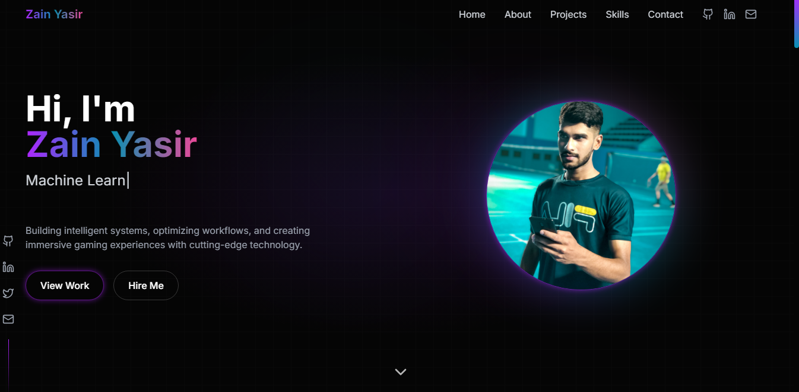

# 🖥️ Zain Yasir - Portfolio Website 🚀  

Welcome to my **personal portfolio website**, where I showcase my skills, projects, and expertise in **Machine Learning, Game Development, and DevOps**!  

🌐 **Live Site:** https://zainyasir.github.io/portfolio/
---

## **✨ Features**  
✅ **Dark-Themed UI** with neon effects 🎨  
✅ **Projects Showcase** with video previews 📹  
✅ **Fully Responsive** & optimized for performance ⚡  
✅ **Built with React + Vite** 🛠️  
✅ **Deployed on GitHub Pages** 🌍  

---

## **🛠️ Tech Stack**  
🔹 **Frontend:** React, TypeScript, TailwindCSS  
🔹 **Backend:** Firebase (Optional)  
🔹 **Deployment:** GitHub Pages  

---

## **📸 Preview**  
  

---

## **🚀 Setup & Run Locally**  
To run this project locally, follow these steps:  

```sh
# Clone the repository
git clone https://github.com/your-username/portfolio.git

# Navigate to the project folder
cd portfolio

# Install dependencies
npm install

# Run the development server
npm run dev
```
Now, open **http://localhost:5173/** in your browser. 🎉  

---

## **🚀 Build & Deploy**  
```sh
npm run build
npm run deploy
```
Your updated portfolio will be live on **GitHub Pages**! 🚀  

---
  

